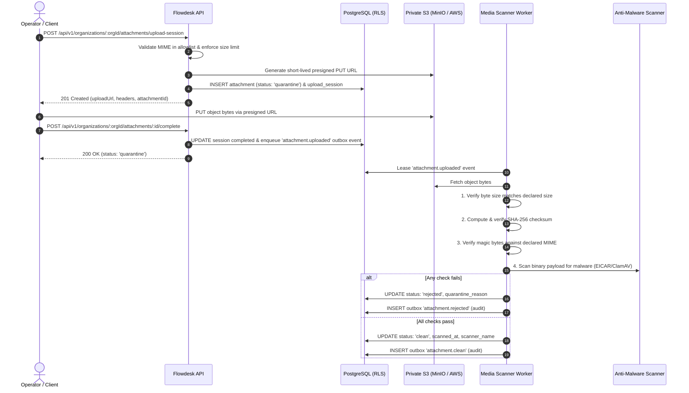

# M3 Media Quarantine, Presigned Upload & Malware Pipeline

## Overview & Threat Model

Flowdesk enforces strict security controls for all customer and operator media attachments under **TM-006** (_Malicious attachment / SSRF / MIME Spoofing_) and **Capability `MEDIA-PIPE-001`** (_Milestone M3-06_).

Attachments must enter a **private quarantine** immediately upon registration and cannot be downloaded, served, or dispatched until asynchronous validation, checksum verification, and anti-malware scanning have succeeded.

---

## 1. Storage Isolation & Key Structure

1. **No Permanent Public URLs:**
   - Attachments are stored exclusively in private S3 buckets (`flowdesk-local` in local compose).
   - Storage keys are strictly tenant-isolated and unguessable:
     $$\text{key} = \text{org-}\{orgId\}\text{/quarantine/}\{attachmentId\}\text{/}\{randomUUID\}$$
2. **Short-Lived Presigned PUT URLs:**
   - Generated using AWS SigV4 with a 15-minute expiry (900 seconds).
   - Require explicit `Content-Type` header match on upload.

---

## 2. Media Allowlist & Size Limits

| Media Category | Permitted MIME Types     | Maximum Size | Magic Bytes / Header Signature |
| :------------- | :----------------------- | :----------- | :----------------------------- |
| **Images**     | `image/jpeg`             | 16 MB        | `FF D8 FF`                     |
|                | `image/png`              | 16 MB        | `89 50 4E 47 0D 0A 1A 0A`      |
|                | `image/webp`             | 16 MB        | `RIFF....WEBP`                 |
| **Audio**      | `audio/ogg`              | 16 MB        | `OggS`                         |
|                | `audio/mpeg`             | 16 MB        | `ID3` or `FF FB` / `FF F3`     |
|                | `audio/mp4`, `audio/aac` | 16 MB        | `....ftyp`                     |
| **Video**      | `video/mp4`              | 100 MB       | `....ftyp`                     |
| **Documents**  | `application/pdf`        | 100 MB       | `%PDF-`                        |

Any file declaring a MIME type not in the allowlist or exceeding the size limit is rejected with HTTP 422 (`DISALLOWED_MIME_TYPE` or `EXCEEDS_SIZE_LIMIT`).

---

## 3. Asynchronous Quarantine Scanner Verification

The worker pipeline (`scanQuarantinedAttachment`) enforces four sequential security gates:

1. **Storage Existence & Byte Length Gate:**
   - Verifies the uploaded object exists and its byte length matches `attachment.byte_size`.
   - Fails closed if the object is missing (`STORAGE_OBJECT_NOT_FOUND`) or if size deviates (`SIZE_MISMATCH`).
2. **SHA-256 Checksum Gate:**
   - Computes SHA-256 of the binary payload.
   - If an expected checksum was supplied at session creation or completion, verifies exact hexadecimal match. Fails closed with `CHECKSUM_MISMATCH` if altered.
3. **Magic-Byte & MIME Gate:**
   - Pure domain function `detectMimeType(headerBytes)` examines the first bytes.
   - If magic bytes indicate executable, script, or mismatched media (e.g. executable disguised as `.jpg`), rejects with `MIME_SPOOFED`.
4. **Anti-Malware Gate:**
   - Streams buffer to `MalwareScanner` adapter (`FakeMalwareScanner` in development/test, ClamAV in production).
   - Detects standard EICAR test string and signatures. Fails closed with `MALWARE_DETECTED`.

---

## 4. API Endpoints

- `POST /api/v1/organizations/:orgId/attachments/upload-session` (Requires `message:send`)
- `POST /api/v1/organizations/:orgId/attachments/:id/complete` (Requires `message:send`)
- `GET /api/v1/organizations/:orgId/attachments/:id` (Requires `conversation:read`)
