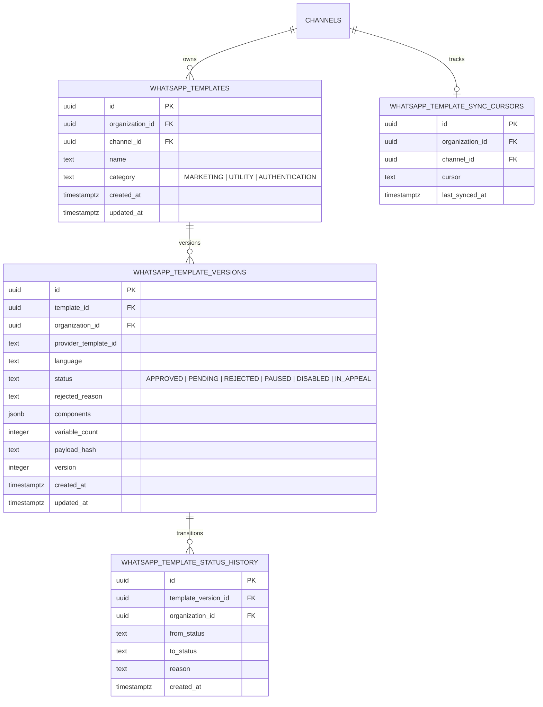

# M3 WhatsApp Templates Data Model & Synchronization Architecture

This document defines the schema, synchronization protocol, and security model for versioned WhatsApp Message Templates in FlowDesk (`M3-04`, capability `TPL-SYNC-001`).

## 1. Relational Data Model

All template tables reside in the `flowdesk` schema with tenant-level Row-Level Security (`FORCE ROW LEVEL SECURITY`).

### Unique Constraints

- `uq_whatsapp_templates_channel_name`: `(channel_id, name)` — Prevents duplicate template names within the same channel.
- `uq_whatsapp_template_versions_template_lang`: `(template_id, language)` — Ensures one active version record per language variation.
- `uq_whatsapp_template_sync_cursors_channel`: `(channel_id)` — One pagination cursor tracked per channel.

---

## 2. Idempotent Synchronization Pipeline

Templates are fetched asynchronously from the WhatsApp Business Account via Graph API `GET /{waba-id}/message_templates` or the deterministic `FakeWhatsAppProvider`.

### Processing Steps

1. **Component Hierarchy Validation**:
   - Exactly one `BODY` component is required with non-empty text.
   - At most one `HEADER`, `FOOTER`, and `BUTTONS` component.
   - If invalid, the worker records a warning and skips the malformed item without throwing or stalling the sync cursor.
2. **Deterministic Payload Hashing**:
   - `computeTemplatePayloadHash` computes a SHA-256 hash over normalized component objects, language code, and category.
3. **Idempotent Database Upsert**:
   - `flowdesk.whatsapp_templates` is upserted on conflict `(channel_id, name)`.
   - Existing language version is inspected `FOR UPDATE`:
     - If `payload_hash` changed, `version` is incremented (`version = version + 1`).
     - If `status` changed (e.g. `PENDING` -> `APPROVED` or `APPROVED` -> `REJECTED`), a new transition is written to `flowdesk.whatsapp_template_status_history`.
     - If both payload and status are unchanged, no version bump occurs and no redundant history is recorded.
4. **Token Redaction & Diagnostic Security**:
   - Worker sync logs and error catchers scrub the channel access token with `[REDACTED_ACCESS_TOKEN]` to prevent secret leakage in monitoring systems.

---

## 3. Sending Eligibility Rules

- Only templates with `status === 'APPROVED'` are eligible for outbound message composition.
- Drafts, `PENDING`, `REJECTED`, `PAUSED`, `DISABLED`, or `IN_APPEAL` templates are immediately blocked from dispatch.
- When Meta updates a template status via webhook or synchronization, the local status change takes effect immediately, blocking downstream message generation.
