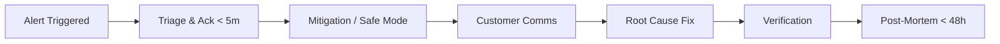

# FlowDesk Incident Operating Model & Alert Routing

This document specifies the incident response structure, severity tiers, alert routing, on-call ownership, status communication procedures, and post-mortem expectations.

---

## 1. Incident Severity Definitions

| Severity          | Definition                                            | Impact Examples                                                                                        | Target MTTA / MTTR                        |
| :---------------- | :---------------------------------------------------- | :----------------------------------------------------------------------------------------------------- | :---------------------------------------- |
| **P1 — Critical** | Total outage of core service or data safety violation | Webhook ingestion halted; AUTO replying erroneously; Database primary unavailable; Killswitch failure. | **MTTA: < 5 min**<br>**MTTR: < 30 min**   |
| **P2 — Major**    | Degraded performance or non-critical path outage      | AI draft failures; Webhook latency > 500ms; Realtime WebSocket disconnects; Outbox queue delay > 5s.   | **MTTA: < 15 min**<br>**MTTR: < 2 hours** |
| **P3 — Minor**    | Minor defect with viable workaround                   | Single background sync failed; Non-critical UI glitch; Intermittent admin report delay.                | **MTTA: < 4 hours**<br>**MTTR: < 2 days** |

---

## 2. On-Call Ownership & Alert Routing

All alerts emitted by Prometheus contain an `owner` and `severity` label. The Alertmanager routes notifications based on these tags:

| Alert Label `owner` | Primary Team    | On-Call Pager Duty / Slack Channel | Runbook Location                              |
| :------------------ | :-------------- | :--------------------------------- | :-------------------------------------------- |
| **`messaging`**     | Team Messaging  | `#oncall-messaging` / PagerDuty    | `docs/runbooks/whatsapp-outbox-dlq.md`        |
| **`automation`**    | Team Automation | `#oncall-automation` / PagerDuty   | `docs/operations/incident-operating-model.md` |
| **`platform`**      | Team Platform   | `#oncall-platform` / PagerDuty     | `docs/runbooks/security-observability.md`     |
| **`ai`**            | Team AI / ML    | `#oncall-ai` / PagerDuty           | `docs/operations/provider-outage-playbook.md` |

---

## 3. Incident Lifecycle Workflow



### Phase 1: Detection & Triage (< 5m)

1. On-call engineer acknowledges page.
2. Establish incident Slack channel (`#inc-YYYYMMDD-<topic>`) and voice bridge.
3. Assign Incident Commander (IC) and Communications Lead.

### Phase 2: Mitigation & Containment (< 15m)

1. **Safety First**: If automated replies or data safety is compromised, trigger the emergency killswitch immediately:
   ```bash
   # Emergency killswitch invocation
   curl -X POST https://api.flowdesk.dev/api/v1/organizations/:orgId/bot/emergency-stop \
     -H "Authorization: Bearer $TOKEN" -d '{"enabled": true}'
   ```
2. If WhatsApp provider is degraded, transition outbox worker to safe-mode backoff.
3. If AI provider is down, degrade tenant mode to `draft` or `off`.

### Phase 3: Communication & Status Page Updates

If incident impacts customers or lasts > 15 minutes:

- Post update to `https://status.flowdesk.dev`.
- Update customer support agents with customer-facing talking points.

### Phase 4: Resolution & Post-Mortem (< 48h)

1. Verify metrics return to baseline on Grafana dashboard `flowdesk-m5-slo`.
2. Schedule blameless post-mortem within 48 hours.
3. File corrective action Jira issues with SLAs for resolution.

---

## 4. Status Page Communication Templates

### Investigating (Posted within 15m of P1 declaration)

> **Title:** Investigating delivery delays on WhatsApp channels  
> **Status:** Investigating  
> **Body:** We are currently investigating an issue causing delayed WhatsApp message delivery and automated responses. Manual agent replies remain active. Our engineering team is actively working to resolve the situation.

### Identified (Posted once root cause is found)

> **Title:** Identified upstream provider latency  
> **Status:** Identified  
> **Body:** We have identified elevated latency with our messaging upstream provider. Queued messages are being retried with exponential backoff and will be delivered safely once upstream capacity stabilizes. No messages are lost.

### Monitoring (Posted once mitigation is deployed)

> **Title:** Mitigation deployed — monitoring recovery  
> **Status:** Monitoring  
> **Body:** A mitigation has been applied and message queues are returning to normal processing times. We are continuing to monitor system metrics closely.

### Resolved

> **Title:** All messaging and automation systems operational  
> **Status:** Resolved  
> **Body:** The incident is fully resolved. All queued messages have been successfully processed, and automated reply latencies are back within normal parameters.
