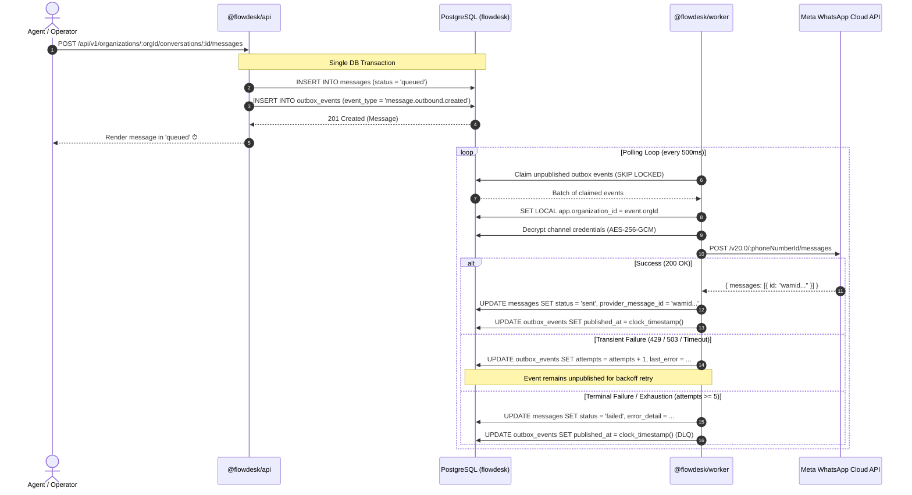

# Operational Runbook: WhatsApp Outbox & Dead-Letter Queue (DLQ)

- **Service:** `@flowdesk/worker`, `@flowdesk/api`, `@flowdesk/db`
- **Ownership:** Engineering & SRE (`@Ryanakml`)
- **Severity Tier:** Tier 1 (Critical Customer Messaging Pipeline)
- **Last Updated:** 2026-08-28

---

## 1. Overview & Architecture

FlowDesk uses the **Transactional Outbox Pattern** to decouple operator API message creation from external WhatsApp Meta Cloud API HTTP calls. This architecture guarantees:

- **At-Least-Once Delivery**: No outbound message is dropped if the worker crashes between database commit and WhatsApp dispatch.
- **Strict Isolation**: Outbox claims execute under tenant Row-Level Security (`SET LOCAL app.organization_id = ...`).
- **Zero Poison-Pill Blocking**: Exhausted or terminal failures transition to a Dead-Letter Queue (DLQ) state, preventing one tenant's failing messages from stalling the global dispatch pipeline.



---

## 2. Failure Classification Matrix

| Error Type                        | Category     | HTTP / Provider Code                | Worker Behavior                                         | Operator Impact                            |
| :-------------------------------- | :----------- | :---------------------------------- | :------------------------------------------------------ | :----------------------------------------- |
| **Rate Limit Exceeded**           | `TRANSIENT`  | `429 Too Many Requests`             | Increments `attempts`; retries with exponential backoff | Message remains `queued` ⏱ until sent      |
| **Gateway Timeout / Network**     | `TRANSIENT`  | `502 / 503 / 504 / ECONNRESET`      | Increments `attempts`; retries with exponential backoff | Message remains `queued` ⏱ until sent      |
| **Expired WhatsApp Access Token** | `TERMINAL`   | `190 (OAuthException)`              | Marks event published, sets message `status = 'failed'` | Message displays ⚠️ failed with auth error |
| **Invalid Customer Phone Number** | `TERMINAL`   | `131026 (Message Undeliverable)`    | Marks event published, sets message `status = 'failed'` | Message displays ⚠️ undeliverable          |
| **Customer Opted Out / Blocked**  | `TERMINAL`   | `131030 (Recipient Cannot Receive)` | Marks event published, sets message `status = 'failed'` | Message displays ⚠️ opted out              |
| **Max Retries Exhausted (>= 5)**  | `EXHAUSTION` | Any repetitive error                | Dead-letters event, sets message `status = 'failed'`    | Message displays ⚠️ retry exhausted        |

---

## 3. Monitoring & Diagnostic Queries

Connect via `psql` to the primary database (`DATABASE_URL`) or inspect via Grafana.

### 3.1. Check Current Outbox Lag & Backlog Size

```sql
SELECT
    count(*) AS pending_events,
    min(occurred_at) AS oldest_pending_event,
    avg(attempts) AS average_attempts
FROM flowdesk.outbox_events
WHERE published_at IS NULL;
```

- **Normal State:** `pending_events` < 100, `oldest_pending_event` < 5 seconds old.
- **Alert State:** `pending_events` > 500 or `oldest_pending_event` > 60 seconds old.

### 3.2. List Actively Retrying Events (High Attempt Count)

```sql
SELECT
    id,
    organization_id,
    aggregate_id AS message_id,
    attempts,
    last_error,
    occurred_at
FROM flowdesk.outbox_events
WHERE published_at IS NULL AND attempts > 0
ORDER BY attempts DESC, occurred_at ASC
LIMIT 25;
```

### 3.3. Review Recent Dead-Lettered Messages (Last 24 Hours)

```sql
SELECT
    m.id AS message_id,
    m.organization_id,
    m.customer_phone,
    m.content,
    m.error_detail,
    m.updated_at
FROM flowdesk.messages m
WHERE m.status = 'failed'
  AND m.updated_at > now() - INTERVAL '24 hours'
ORDER BY m.updated_at DESC
LIMIT 50;
```

---

## 4. Remediation Procedures

### Procedure 4.1: Replaying Dead-Lettered Messages After Downstream Outage

When Meta WhatsApp API recovers from an outage and you need to replay messages that exhausted retries:

1. **Verify Outage Resolution**: Test sending a test ping via `POST /api/v1/channels/:id/ping`.
2. **Re-enqueue Dead-Lettered Events**:
   Execute the following migration in a transaction:

```sql
BEGIN;
-- Select target messages to re-enqueue
UPDATE flowdesk.messages
SET status = 'queued',
    error_detail = NULL,
    updated_at = clock_timestamp()
WHERE id IN ('<message_id_1>', '<message_id_2>')
  AND status = 'failed';

-- Reset corresponding outbox events for immediate worker pickup
UPDATE flowdesk.outbox_events
SET published_at = NULL,
    attempts = 0,
    last_error = NULL,
    occurred_at = clock_timestamp()
WHERE aggregate_id IN ('<message_id_1>', '<message_id_2>')
  AND event_type = 'message.outbound.created';
COMMIT;
```

3. **Verify Worker Processing**: Run query 3.1 to verify `pending_events` decreases to 0.

### Procedure 4.2: Rotating Expired Meta WhatsApp Cloud API Access Tokens

If messages fail with `OAuthException` (Code `190`):

1. Generate a new System User Permanent Access Token in the Meta Business Manager.
2. Encrypt the new access token with the environment's master `CHANNEL_ENCRYPTION_KEY`:
   ```bash
   node -e "
     import { encryptSecret } from '@flowdesk/security';
     const token = process.argv[1];
     const key = process.env.CHANNEL_ENCRYPTION_KEY;
     console.log(JSON.stringify(encryptSecret(token, key)));
   " "EAAG..."
   ```
3. Update the channel record:
   ```sql
   UPDATE flowdesk.channels
   SET encrypted_credentials = '<encrypted_json_envelope>',
       status = 'active',
       status_reason = NULL,
       updated_at = clock_timestamp()
   WHERE id = '<channel_id>';
   ```
4. Follow **Procedure 4.1** to replay failed messages for that channel.

---

## 5. Key Metrics & Alerting Thresholds

| Metric                            | Target | Warning Threshold | Critical Threshold |
| :-------------------------------- | :----- | :---------------- | :----------------- |
| `outbox_pending_events_count`     | 0 - 50 | > 200 for 2 min   | > 1,000 for 5 min  |
| `outbox_oldest_event_age_seconds` | < 2s   | > 30s             | > 120s             |
| `outbox_retry_rate_per_min`       | < 1%   | > 5%              | > 15%              |
| `messages_failed_total`           | 0      | > 10 / hour       | > 50 / hour        |
